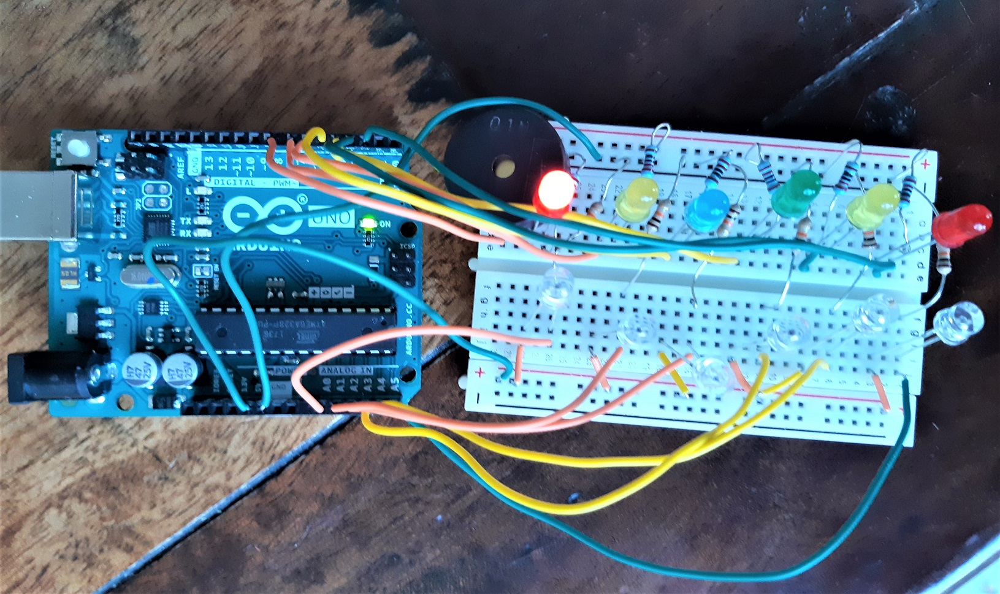

# arduipiano
A Basic Piano made with an Arduino Board, 6 photocells, 6 LEDs and a buzzer

Two Arduino sketches are included: a basic mode, and a lesson mode where the LEDs show how to play "Twinkle, Twinkle, Little Star".

The piano is played by putting fingers on top of each of the photocells, which play notes C, D, E, F, G and A.

This is done with the contents of the official Arduino starter kit.

Schematics might follow someday, if I find time to make them
